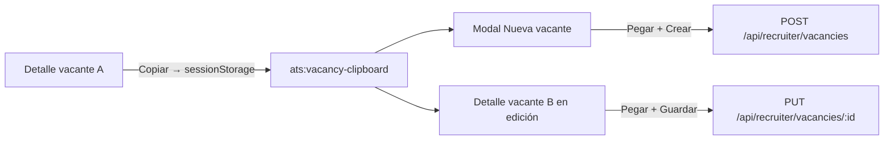

# Copiar y pegar vacantes

## En una frase

Agregar **Copiar** en el detalle de una vacante y **Pegar** al crear o editar otra, para rellenar el formulario con los mismos datos de contenido sin un endpoint de duplicado.

## Lo que ya funciona

- El detalle (`/portal-rrhh/vacantes/[id]`) ya tiene el grupo de acciones a la derecha: Editar vacante, Entrevistas, Resultados.
- Crear vacante es el modal `NuevaVacanteModal` desde el listado; no hay página de alta aparte.
- Editar es el mismo detalle en modo `isEditing` (no hay formulario de edición separado).
- Ambos formularios usan `useState` (no react-hook-form) y los mismos campos de contenido.
- El feedback al usuario ya pasa por `Snackbar`.
- No existe “duplicar vacante” ni un `POST` de clone en el backend.

## Los 6 problemas / objetivo

1. **El reclutador repite el mismo formulario.** Hoy hay que reescribir título, descripción, requisitos, ubicación, etc. para una vacante casi igual.
2. **Copiar no debe crear la vacante sola.** El usuario copia en A, navega por su cuenta al alta o a B, y pega. Pegar no navega.
3. **Hay que decidir qué se copia.** Solo campos de formulario. No IDs, estado, fechas, postulantes, IA ni logo.
4. **Pegar en edición pisa datos reales.** En alta el form suele estar vacío; en edición ya está hidratado. Hace falta confirmación al sobrescribir.
5. **El texto del botón debe seguir el idioma de la UI.** Los botones vecinos están en español vía `next-intl` (y en 5 idiomas). “Copy” en inglés rompería el patrón.
6. **La copia tiene que sobrevivir el salto de página.** Detalle → listado (modal) o detalle A → detalle B. Un store solo en memoria se pierde al recargar.

## Qué hay que hacer

1. Crear un módulo cliente `lib/vacancies/vacancy-clipboard.ts` (leer/escribir/validar payload en `sessionStorage`).
2. Añadir claves i18n en `es`, `en`, `it`, `de`, `fr`: Copiar, Pegar, toasts y confirmación de sobrescritura.
3. En el detalle, en vista (no edición), poner **Copiar** a la derecha de Resultados, en escritorio y móvil, con el mismo estilo outline de esos botones.
4. Al copiar: serializar la vacante visible, guardar el payload, mostrar toast de éxito. También en vacantes de solo lectura (el objetivo es clonar contenido a una nueva).
5. En `NuevaVacanteModal`, mostrar **Pegar** (arriba del form o a la izquierda del footer). Deshabilitado si no hay copia, con `aria-label` que lo explique.
6. En modo edición del detalle, mostrar **Pegar** junto a Guardar. Misma regla de deshabilitado.
7. Pegar en alta: rellenar campos, incluida la empresa. Si el usuario ya escribió algo, pedir confirmación. Si el form está vacío, pegar directo.
8. Pegar en edición: pedir confirmación siempre. Rellenar campos de contenido; **no** cambiar empresa, estado ni IDs. No guardar todavía: el usuario sigue en edición y pulsa Guardar.
9. Tras pegar, toast de éxito. Los IDs de filas de requisitos se regeneran para no chocar en React.
10. Tests unitarios del helper (round-trip, payload inválido, qué campos entran/salen) y paridad i18n de las claves nuevas.
11. Correr `npm run spellcheck`. Copiar/Pegar no deberían pedir diccionario; solo añadir a `cspell-project-words.txt` si cspell marca algún identificador nuevo.

## Fuera de alcance

- Endpoint backend de duplicar vacante.
- Copiar en las tarjetas del listado.
- Autocompletar al abrir el modal (el usuario pulsa Pegar).
- Pegar no navega ni crea la vacante.
- Sufijo automático en el título tipo “(copia)”.
- Zustand, Clipboard API del sistema o `localStorage`.

## Decisiones de producto

**1. Almacenamiento: `sessionStorage`.**
Sirve entre detalle, listado y otra vacante, y aguanta un refresh de la pestaña. Se borra al cerrar la pestaña, así no pega datos de hace días. El repo ya usa `sessionStorage` para empresa de vacante (`ats:vacancy-company:`). No hay Zustand. La Clipboard API pide permisos, no deja saber si hay una vacante copiada sin leer, y el usuario puede pisar el portapapeles. Clave: `ats:vacancy-clipboard`, JSON versionado (`version: 1`).

**2. Campos que sí se copian**

- Nombre (`title`)
- Descripción (`description`)
- Detalles (`details`)
- Salario (`salary`)
- Ventajas (`advantages`)
- País y estado (`countryCode`, `stateCode`)
- Área / departamento (`vacancyDepartmentId`)
- Modalidad (`vacancyModalityId`)
- Requisitos (nombre, valor, importancia 1–10)
- Empresa (`companyId`) — se aplica **solo al crear**

**Campos que no se copian**

- `id` / `uuid`
- Estado, activa/inactiva, proceso finalizado
- Fechas (`createdAt`, etc.)
- Postulantes, etapas, estados de postulación
- Sugerencias de IA, rematch, logo
- Calificación/comentarios de cierre
- `weights.semantic` (en alta siempre es `0.5`; en edición se deja el de la vacante destino)

**3. UX de Pegar**

- Alta: botón en el modal de crear.
- Edición: botón junto a Guardar (solo con `isEditing`).
- Sin copia: botón **visible y deshabilitado** (así se descubre la función).
- Toast al copiar y al pegar (`Snackbar`, como el resto del módulo).
- Confirmación al sobrescribir: sí en edición siempre; en alta solo si el form ya tiene datos. No usar `DeleteConfirmModal` (estilo destructivo). Un `Modal` chico con Pegar / Cancelar.

**4. Etiqueta: Copiar / Pegar vía i18n.**
No hardcodear “Copy”. En español: Copiar / Pegar. En inglés: Copy / Paste. Igual en it/de/fr.

**5. Crear vs editar**

- Crear: pega en un form vacío, **incluye empresa** (mismo cliente).
- Editar: pisa campos de contenido y **no cambia la empresa** (cambiar cliente es un PATCH aparte y es fácil equivocarse).

**6. ¿Pegar navega?** No. El usuario copia en A, va al listado o a B, y pega.

---

## Anexo: referencias técnicas

### Flujo



### Dónde está cada pieza

- Acciones del header (duplicadas escritorio / móvil): `app/portal-rrhh/vacantes/[id]/page.tsx` — escritorio ~2130–2176, móvil ~2981–3008. Copiar va **después** del Link de Resultados. Mismo `className` outline que Entrevistas/Resultados (`border border-border … px-4 py-2.5`). Sin icono: esos botones son solo texto.
- Hidratar edición desde API: `hydrateEditFormFromVacancy` en el mismo archivo (~1008). Reutilizar esa idea al pegar.
- Guardar edición: `handleSaveVacancy` → `PUT /api/recruiter/vacancies/:id`. Pegar solo hace `setState`; no llama al API.
- Alta: `components/rrhh/NuevaVacanteModal.tsx` → `POST /api/recruiter/vacancies`. Listado: `app/portal-rrhh/vacantes/page.tsx`.
- i18n acciones actuales: `messages/es.json` → `RecruiterPortal.vacancies.detail.actions` (`editVacancy`, `interviews`, `results`) y `RecruiterPortal.vacancies.form.actions`.
- Toast: `setSnackbar` en detalle y `onSnackbar` en el modal.
- Requisitos: objeto `{ [snake_case]: valor }` + `weights.attributes` (0.1–1.0). Al pegar, reconstruir filas `{ id nuevo, requirementName, requirementValue, scale }` como en `hydrateEditFormFromVacancy`.

### Payload sugerido

```ts
interface VacancyClipboardPayload {
 version: 1
 title: string
 description: string
 details: string
 salary: string
 advantages: string
 countryCode: string
 stateCode: string
 vacancyDepartmentId: string
 vacancyModalityId: string
 companyId: string
 requirements: Array<{
 requirementName: string
 requirementValue: string
 scale: number
 }>
}
```

Validar `version === 1` y tipos al leer. Si el JSON está corrupto, tratarlo como “sin copia”.

### Carrera en el modal de alta

Al abrir, `loadCompanies` pone `selectedCompanyId` al default. Pegar es un clic del usuario, en general después de esa carga. Aun así: no pisar `selectedCompanyId` si el usuario (o Pegar) ya eligió otra empresa.

Si un `departmentId` / `modalityId` copiado ya no está en el catálogo activo, el select queda vacío; es aceptable.

### Claves i18n (añadir en 5 locales)

`RecruiterPortal.vacancies.detail.actions.copy` / `copyAria`
`RecruiterPortal.vacancies.detail.toasts.copied`
`RecruiterPortal.vacancies.form.actions.paste` / `pasteAria` / `pasteDisabledAria`
`RecruiterPortal.vacancies.form.toasts.pasted`
`RecruiterPortal.vacancies.form.pasteConfirm.title` / `message` / `confirm`

Ejemplo ES: “Copiar”, “Vacante copiada.”, “Pegar”, “No hay una vacante copiada.”, “Esto reemplazará los campos actuales del formulario.”

Los tests de paridad (`recruiter-vacancy-detail-i18n.test.tsx`, `recruiter-vacancy-form-i18n.test.tsx`) deben seguir pasando con las keys nuevas.

### Estilo

- Detalle: `<button>` nativo como los vecinos, no `components/ui/Button` (ese usa otro padding).
- Modal: sí puede usar `Button variant="outline"`.
- Copiar también en vacantes read-only; Pegar no, si la vacante no se puede editar.
- Sin punto y coma en código nuevo si el archivo destino ya va así; en estos archivos hay mezcla, igualar el archivo que se toque.

### CI

`npm run spellcheck` (cspell sobre `app/`, `components/`, `lib/`). Identificadores tipo `clipboard` suelen pasar el diccionario inglés.
