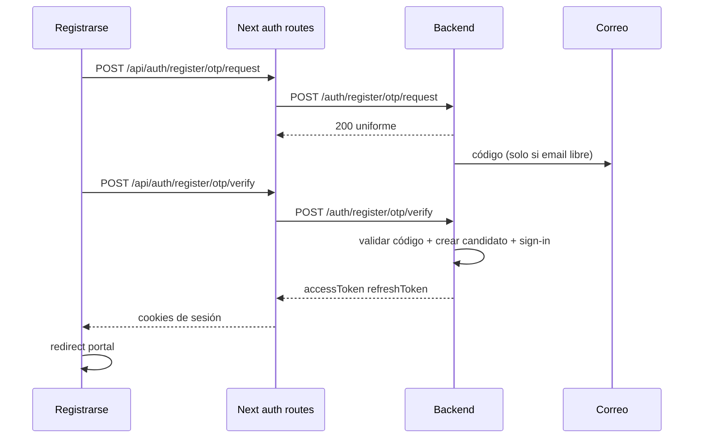

# Registro de candidato con One-Time Password

## En una frase

Un candidato nuevo pone su correo en `/auth/registrarse`, recibe un código, lo confirma, elige contraseña, se crea la cuenta y entra al sistema ya autenticado.

## Cómo se ejecuta este plan (obligatorio)

El archivo es **idéntico** en `ats-backend` y `ats-frontend`. El agente implementa **un solo lado** según el repo donde corre.

Detectar el repo:

- **Backend** si existe `engine.sln` o `MatchEngine.Core/`.
- **Frontend** si existe `app/auth/registrarse/page.tsx` y `package.json` con Next.js.

Reglas:

1. En **backend**: solo sección Backend. No editar, commitear ni abrir el repo `ats-frontend`.
2. En **frontend**: solo sección Frontend. No editar `ats-backend`. Asumir el contrato de API de este plan.
3. Rama local `feature/register-otp` desde `develop`. Git del backend desde `engine/`. No push ni Merge Request salvo que lo pidan.
4. Test Driven Development: test que falle → implementación mínima → refactor.
5. Ticket: [SCRUM-548](https://visible-outsource-ats-ai.atlassian.net/browse/SCRUM-548).

## Lo que ya funciona

- Registro actual: email + contraseña → `POST /register` → usuario Identity + rol Candidate + perfil. **No** inicia sesión.
- Login: `POST /login` emite tokens Bearer. El frontend guarda sesión en cookies vía `POST /api/auth/login`.
- Correo transaccional: Mailgun / `IEmailProvider`. Reset de contraseña ya hashea tokens y no enumera cuentas.
- Onboarding reutilizable: `ICandidateOnboardingService.CreateWithPasswordAsync`.
- Límite de intentos por IP en registro (`auth-register`).

## Los 4 objetivos

1. **Probar el correo antes de crear la cuenta.** El usuario no existe hasta que el código sea válido y la contraseña pase la política.
2. **Misma pantalla.** Tres pasos en `/auth/registrarse`: correo → código → contraseña.
3. **Entrar de una.** Si el código y la contraseña son válidos, se crea el candidato y se emite la misma sesión que el login (`accessToken` + `refreshToken`).
4. **Sin filtrar cuentas.** Pedir el código siempre responde igual, exista o no el correo. El código se guarda hasheado, no se loguea, expira y es de un solo uso.

## Qué hay que hacer

### Contrato compartido (no implementar dos veces)

1. `POST /auth/register/otp/request` — body `{ "email" }`. Siempre 200 con el mismo mensaje. Envía correo solo si el email no tiene cuenta.
2. `POST /auth/register/otp/verify` — body `{ "email", "code", "password" }`. Si ok: crea candidato, inicia sesión, 200 con `accessToken`, `refreshToken`, `expiresIn` (mismo shape que `/login`).
3. Errores de verify: 400 validación (email/código/contraseña); 401 código inválido, vencido o agotado (mensaje único); 429 rate limit. Correo duplicado en verify = mismo texto genérico que el registro actual (sin confirmar que la cuenta existe).
4. Defaults configurables: código de 6 dígitos, 10 minutos, 5 intentos fallidos, reenvío cada 60 s, 3 solicitudes por correo por hora.

### Backend (solo si este repo es ats-backend)

5. Rama `feature/register-otp` desde `develop` (git en `engine/`).
6. RED unidad: hash, expiración, intentos, cooldown, no enumerar, no crear usuario si el código falla, política de contraseña, onboarding solo tras código válido.
7. RED integración (Docker activo: `docker info`): request 200 uniforme; verify crea usuario + tokens; código malo/vencido; reenvío; 429; allowlist anónima.
8. Entidad de desafío (email normalizado + hash del código + fechas + intentos). Migración Entity Framework.
9. Servicio + endpoints anónimos + rate limits nuevos. Correo ApplicanTree (HTML + texto). Auditoría sin código ni correo completo.
10. GREEN. `POST /register` **sigue vivo** para no romper el frontend actual.
11. Actualizar `task.md`, `.agents/ROADMAP.md` y la allowlist anónima.

### Frontend (solo si este repo es ats-frontend)

12. Rama `feature/register-otp` desde `develop`.
13. RED: tests del wizard (correo → código → contraseña), 429, error genérico, no filtrar si el correo existe.
14. Rutas Next (como el login, no el puente BFF genérico): `POST /api/auth/register/otp/request` y `POST /api/auth/register/otp/verify`. El verify llama `createAuthSessionResponse` y setea cookies.
15. Reescribir `/auth/registrarse`: paso 1 correo; paso 2 código + reenviar; paso 3 contraseña y confirmar. Éxito → sesión + redirect (`from` o `/seleccion-portal`).
16. Textos en `es`, `en`, `fr`, `de`, `it`.
17. GREEN. Dejar de llamar `POST /register`.

## Fuera de alcance

- Login por código (el login sigue siendo email + contraseña).
- One-Time Password de Admin / segundo factor (BE-SEC-011).
- Cerrar `POST /register` con 410: follow-up de backend **después** de que el frontend nuevo esté en `develop`.
- Cambiar LinkedIn SSO.

## Anexo: referencias técnicas

### Flujo



### Backend — piezas a tocar

- Nuevo: `RegistrationOtpChallenge` (Core), `RegistrationOtpOptions`, `IRegistrationOtpService`.
- Patrón a copiar: `PasswordResetToken` + `PasswordResetService` (hash SHA-256, no persistir claro, no loguear secreto).
- Crear usuario: `ICandidateOnboardingService.CreateWithPasswordAsync` (ya pone `EmailConfirmed = true`).
- Emitir sesión: mismo esquema Bearer que `POST /login` / refresh (`SignInManager` + `IdentityConstants.BearerScheme`).
- Mapear en `Program.cs` junto a `/auth/forgot-password`. AllowAnonymous + policies `auth-register-otp-request` y `auth-register-otp-verify`.
- Allowlist: `AnonymousEndpointDataSourceAllowlistTests`.
- Config: `RegistrationOtp` en `appsettings.json` (sin hardcodear TTL/largo/intentos).
- Eventos: `registration_otp_requested`, `registration_otp_failed`, `registration_succeeded` en `SecurityEventTypes` (metadata: dominio del email, nunca el código).
- Tests actuales de `POST /register` no se rompen.

### Frontend — piezas a tocar

- `app/auth/registrarse/page.tsx` (hoy `apiClient.post("/register", { email, password })` y redirect a login).
- Nuevas: `app/api/auth/register/otp/request/route.ts`, `app/api/auth/register/otp/verify/route.ts`.
- Reusar: `createAuthSessionResponse`, `csrfHeaders`, `parseRetryAfterSeconds`, `resolveAuthRedirectDestination`.
- i18n: `messages/*.json` → `Auth.register`.
- Proxy: `/auth/registrarse` ya es pública.

### Request / verify (contrato)

Request 200 (siempre):

```json
{ "message": "Si el correo es válido, te enviamos un código." }
```

Verify 200:

```json
{
  "accessToken": "...",
  "refreshToken": "...",
  "expiresIn": 3600
}
```

Verify 401 (código):

```json
{ "detail": "El código no es válido o venció." }
```

### Validaciones del código (backend)

- 6 dígitos, generado con RNG criptográfico.
- Persistir solo `SHA256(code)`.
- Un desafío activo por email; un request nuevo invalida el anterior.
- Comparación de tiempo constante.
- `ConsumedAt` atómico (un solo uso).
- Cooldown de reenvío; tope por email/hora además del rate limit por IP.
- No devolver el código en ningún ambiente (ni Development). En local el correo real (Mailgun) o el provider de tests.
- `LoggingEmailProvider` no debe loguear el cuerpo ni el código (ya hay tests canary de reset).
